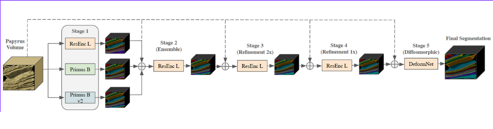
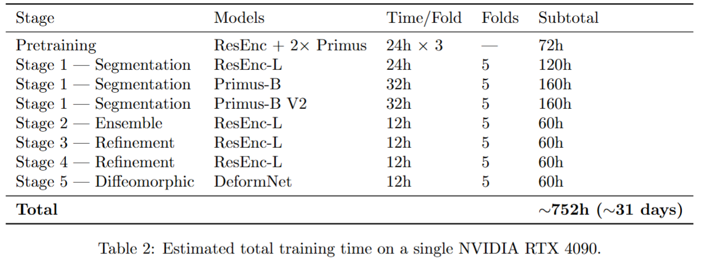

# Vesuvius Challenge — 10th Place Solution

This repository contains code for the 10th place solution of the [Vesuvius Challenge - Surface Detection Competition](https://www.kaggle.com/competitions/vesuvius-challenge-surface-detection/overview).

Solution write-up: [10th Place Solution](https://www.kaggle.com/competitions/vesuvius-challenge-surface-detection/writeups/10th-place-solution)

Our approach uses a 5-stage sequential pipeline: **Segmentation → Learned Ensemble → Refinement (×2) → Diffeomorphic Deformation**



---

## Acknowledgements

We thank Kaggle and the Vesuvius Challenge organizers for a fascinating competition.

Although the majority of the training pipeline was implemented outside the original nnUNet framework, most architectures are derived from work produced by [MIC-DKFZ](https://github.com/MIC-DKFZ). We are grateful to them for advancing the 3D segmentation domain.

---

## Solution Overview

### 1st Stage — Initial Segmentation

We trained three independent models:

- **ResEnc-L UNet** (4× TTA): The standard nnUNet-style residual encoder UNet with channels `(32, 64, 128, 256, 320, 320)` and `n_blocks=(1,3,4,6,6,6)`.
- **Primus-B**: A transformer-based segmentation model from the [`dynamic-network-architectures`](https://github.com/MIC-DKFZ/dynamic-network-architectures) library by MIC-DKFZ.
- **Primus-B V2**: An improved variant of Primus-B. 

All models were trained at patch size 160³ with AdamW (`lr=5e-5`, `wd=1e-4`) and mixed-precision training for approximately 400 epochs.

**Loss function:** combination of Dice Loss, Cross-Entropy Loss, Skeleton Recall Loss, and Surface Dice Loss (a modified version of clDice for 2D manifolds in 3D environments; original implemented for CryoET membrane segmentation).

From local evaluation, the best models were **Primus-B V2 > ResEnc-L > Primus-B**. The models are highly complementary.

### 2nd Stage — Learned Ensemble

The idea here was to let a model learn the complementarity between predictions. The model takes a 4-channel input: `[Image, ResEnc-L binary mask, Primus binary mask, PrimusV2 binary mask]`.

- ResEnc-L UNet ensembles first-stage predictions.
- We trained with a random threshold on the fly ranging from 0.1 to 0.7, but used a threshold of 0.3 at inference.

### 3rd Stage — Refinement

We used the same random threshold strategy on the fly. If the threshold is low, we hope the model learns to correct merged sheets; if it is high, we hope the model learns to correct broken sheets.

We also added a strong `randCoarseDropout` to mask the input to help the model learn continuity and fix holes.

- **Input:** `[Image, 2nd stage binary]`
- ResEnc-L UNet refinement.

### 4th Stage — Refinement

Just another refinement network. Same idea as Stage 3, help the model learn to correct residual errors.

- **Input:** `[Image, 3rd stage binary]`
- ResEnc-L UNet refinement.

### 5th Stage — Diffeomorphic Stage *(biggest boost)*

The diffeomorphic network takes the role of shape calibration and thickness modification. Unlike classic refinement which just reproduces a better segmentation prediction, this network predicts a **stationary velocity field** that manipulates the input mask from the previous stage. Intuitively, it is a vector field that determines how the mesh changes in 3D space.

This approach is inspired by [Chen et al.](https://www.sciencedirect.com/science/article/abs/pii/S0893608023003684) (Perceptual Contrastive GAN based on image warping for unsupervised image-to-image translation) and [FlowNet 2.0](https://arxiv.org/abs/1612.01925).

- **Input:** `[Image, 4th stage binary]`

---

## Setup

### Hardware Requirements

| Component | Recommended |
|-----------|-------------|
| OS | Ubuntu 22.04 |
| RAM | ≥ 32 GB |
| Disk Space | ≥ 500 GB |
| CPU Cores | ≥ 8 |
| GPU | NVIDIA RTX 4090 (24 GB) or similar |

Any GPU with more than 24 GB VRAM should work. For a single RTX 4090, reproducing the entire pipeline takes approximately 31 days, as shown in the table below.



> **Note:** Stage 4 can be removed without degrading performance; it was kept here for full reproducibility.

### Environment Setup

```bash
# Create conda environment
conda create -n vesuvius python=3.10
conda activate vesuvius

# Install dependencies
pip install -r requirements.txt
```

> **Note:** torch 2.9.x has a bug for 3D convolutions. Use torch 2.8.0 or 2.10.0+. See [pytorch#166122](https://github.com/pytorch/pytorch/issues/166122).

### Kaggle API

Make sure your Kaggle API token is configured at `~/.kaggle/kaggle.json` before running Step 1.

---

## Reproducing the Pipeline

Run the steps in order. Each step script is self-contained and assumes the previous step completed successfully.

| Step | Script | Description |
|------|--------|-------------|
| 1 | `scripts/step1_download_kaggle_data.sh` | Download competition data from Kaggle |
| 2 | `scripts/step2_convert_to_npy.sh` | Convert TIF images/labels to NPY format |
| 3 | `scripts/step3_download_pretrain_data.sh` | Download additional labeled data for pretraining |
| 4 | `scripts/step4_pretrain.sh` | Pretrain ResEncL, Primus, PrimusV2 on additional data |
| 5 | `scripts/step5_train_5fold.sh` | Train 5-fold CV for each model (fine-tune from pretrained) |
| 6 | `scripts/step6_generate_oof.sh` | Generate OOF predictions for each 1st-stage model |
| 7 | `scripts/step7_train_2nd_stage.sh` | Train 2nd stage 5-fold (`image + 3 OOF channels`) |
| 8 | `scripts/step8_generate_2nd_stage_oof.sh` | Generate 2nd stage OOF probability maps |
| 9 | `scripts/step9_train_3rd_stage.sh` | Train 3rd stage refinement (`image + 2nd stage OOF`) |
| 10 | `scripts/step10_generate_3rd_stage_oof.sh` | Generate 3rd stage OOF probability maps |
| 11 | `scripts/step11_train_4th_stage.sh` | Train 4th stage refinement (`image + 3rd stage OOF`) |
| 12 | `scripts/step12_generate_4th_stage_oof.sh` | Generate 4th stage OOF probability maps |
| 13 | `scripts/step13_train_5th_stage.sh` | Train 5th stage DeformNet (`image + 4th stage OOF`) |

```bash
chmod u+x scripts/*.sh
./scripts/step1_download_kaggle_data.sh
./scripts/step2_convert_to_npy.sh
# ... and so on
```

---

## Directory Structure

```
train.csv                      # Competition CSV
train_images/                  # Raw TIF images (from Kaggle)
train_labels/                  # Raw TIF labels (from Kaggle)
train_images_npy/              # Converted NPY images
train_labels_npy/              # Converted NPY labels
train_skeletons_npy/           # Precomputed skeletons (for Skeleton Recall Loss)
additional_data/               # Pretrain data (from scrollprize.org)
  images/, labels/, samples.csv
pretrained_checkpoints/        # Pretrained model weights
  resencl/, primus/, primus_v2/
cv_outputs_resencl/            # 1st stage 5-fold outputs (ResEncL)
cv_outputs_primus/             # 1st stage 5-fold outputs (Primus)
cv_outputs_primus_v2/          # 1st stage 5-fold outputs (PrimusV2)
1st_stage_cache/               # ResEncL OOF probability maps
Primus_1st_stage_cache/        # Primus OOF probability maps
PrimusV2_1st_stage_cache/      # PrimusV2 OOF probability maps
cv_outputs_2nd_stage/          # 2nd stage 5-fold outputs
2nd_stage_cache/               # 2nd stage OOF probability maps
cv_outputs_3rd_stage/          # 3rd stage 5-fold outputs
3rd_stage_cache/               # 3rd stage OOF probability maps
cv_outputs_4th_stage/          # 4th stage 5-fold outputs
4th_stage_cache/               # 4th stage OOF probability maps
cv_outputs_5th_stage/          # 5th stage DeformNet 5-fold outputs
scripts/                       # Pipeline step scripts (step1–step13)
src/                           # 1st stage training code
src_2nd_4th_stages/            # 2nd, 3rd, 4th stage training code
src_deformnet_stage/           # 5th stage DeformNet training code
dynamic-network-architectures/ # Local fork (Primus / PrimusV2 models)
```

---

## Key Architecture Details

| Model | Type | Channels | Blocks |
|-------|------|----------|--------|
| ResEnc-L | Residual Encoder UNet | 32, 64, 128, 256, 320, 320 | 1, 3, 4, 6, 6, 6 |
| Primus-B | Transformer UNet | — | `drop_path_rate=0.0` |
| Primus-B V2 | Transformer UNet | — | `drop_path_rate=0.2` |

**Shared training settings (stages 1–4):**
- Patch size: 160³
- Optimizer: AdamW (`lr=5e-5` pretrain, `lr=1e-4` fine-tune, `wd=1e-4`)
- Mixed precision: enabled
- Deep supervision: 4 levels, weights `[0.4, 0.4, 0.1, 0.1]`
- EMA: decay `0.999`, warmup `1000` steps
- Loss: Dice + Cross-Entropy + Skeleton Recall + Surface Dice

---

## References

- Isensee et al. **Primus: Enforcing Attention Usage for 3D Medical Image Segmentation** — [openreview.net](https://openreview.net/forum?id=YWwGmmObri)
- Lamm et al. **MemBrain v2: An end-to-end tool for the analysis of membranes in cryo-electron tomography** *(Surface Dice Loss)* — [biorxiv.org](https://www.biorxiv.org/content/10.1101/2024.01.05.574336v1.full.pdf)
- Shit et al. **Skeleton Recall Loss for Connectivity Conserving and Resource Efficient Segmentation of Thin Tubular Structures** — [ECCV 2024](https://www.ecva.net/papers/eccv_2024/papers_ECCV/papers/09904.pdf)
- MIC-DKFZ **dynamic-network-architectures** library — [github.com/MIC-DKFZ/dynamic-network-architectures](https://github.com/MIC-DKFZ/dynamic-network-architectures)
- Wald et al. **PrimusV2** *(unmerged fork)* — [github.com/TaWald/dynamic-network-architectures](https://github.com/TaWald/dynamic-network-architectures/blob/main/dynamic_network_architectures/architectures/primus.py)
- Chen et al. **Perceptual Contrastive Generative Adversarial Network based on image warping for unsupervised image-to-image translation** — [sciencedirect.com](https://www.sciencedirect.com/science/article/abs/pii/S0893608023003684)
- Ilg et al. **FlowNet 2.0: Evolution of Optical Flow Estimation with Deep Networks** — [arxiv.org/abs/1612.01925](https://arxiv.org/abs/1612.01925)

---

## Contact

For any questions, feel free to reach out: sasjsergioalvarezjunior@gmail.com
